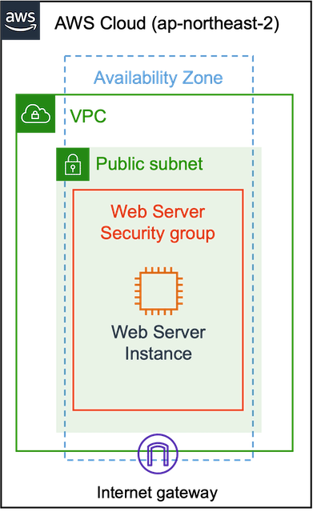

## Simple Web Server by Terraform

AWS Cloud 위에 Security Group, Instance 만을 정의하여 간단한 웹서버를 작동시킵니다.




전체적인 아키텍처는 위 그림과 같지만, 대부분 default 리소스를 사용하기 때문에 코드로 정의하는 부분은 Security Group, Instance에 불과합니다.

<br>


### [최신 AMI Number 알아내기](https://docs.aws.amazon.com/ko_kr/AWSEC2/latest/UserGuide/finding-an-ami.html)

**awscli 활용** (AMZN Linux 2)

```shell
aws ec2 describe-images \
    --owners amazon \
    --filters "Name=name,Values=amzn2-ami-hvm-2.0.????????.?-x86_64-gp2" "Name=state,Values=available" \
    --query "reverse(sort_by(Images, &Name))[:1].ImageId" \
    --output text
```

**awscli & jq 활용** (AMZN Linux 2)

```shell
aws ec2 describe-images \
    --owners amazon \
    --filters "Name=name,Values=amzn2-ami-hvm-2.0.????????.?-x86_64-gp2" "Name=state,Values=available" \
    --query "reverse(sort_by(Images, &Name))[:1].ImageId" | jq '.[0]'
```
