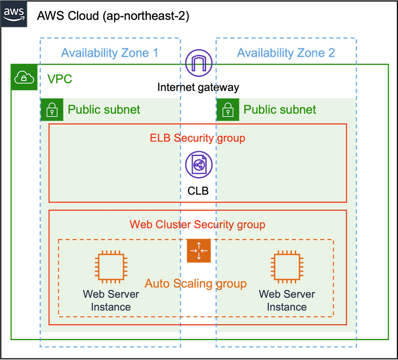

## Simple Web Server by Terraform

AWS Cloud 위에 security group, Instance, launch configuration, ASG, CLB 만을 정의하여 웹서버 클러스터를 작동시킵니다.

 

### Terraform Resource Lifecycle

`create_before_destory` 를 `true` 로 설정하면 코드를 변경해 리소스를 대체할 때, 새로운 리소스를 먼저 생성하고 예전 리소스를 지우도록하여 리소스 재생성으로 인한 downtime을 최소화 한다.
